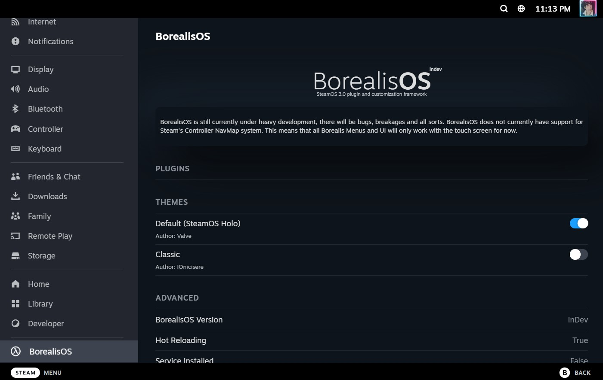

<p align="center">
</img>
</p>
<h1 align="center">BorealisOS</h1>
<p align="center">A SteamOS 3.0 plugin and customisation framework built using NodeJS.</p>

<br>
<br>

<details>
<summary>
<h2>DISCLAIMER (READ ME!)</h22>
</summary>

```
BorealisOS is a plugin manager that gives (currently) unrestricted access to SteamOS's JavaScript instance. 

Valve binds all SteamOS system functions to this JavaScript instance. Treat installing BorealisOS plugins like installing 
apps that require administrator rights because they quite literally can perform administrator actions without you even 
knowing.

Make sure you review all plugins you install and DO NOT install any plugins you do not inherently trust. Anything with
obfuscation or not very readable code is a big red flag. It would take not even 20 lines of JavaScript to steal your
account token and factory reset the device.

We are not responsible for any device damage caused by using BorealisOS.
```

</details>

<h2>Installation</h2>
BorealisOS is currently under heavy development and is not suggested for general use.

__BorealisOS requires CEF Debugging to be enabled within the Developer settings__

If you still want to install BorealisOS, you can do so by running the following command:

```sh
curl -s -L https://github.com/borealisOS/borealisOS/raw/main/install.sh | sudo sh
```

This installer installs a service for borealisOS which will make it autolaunch on start up, you can disable this by running the following command:

```sh
sudo systemctl disable borealis
```

You can also uninstall borealisOS by running the following command:

```sh
curl -s -L https://github.com/borealisOS/borealisOS/raw/main/uninstall.sh | sudo sh
```


This installer and uninstaller only supports the Steam Deck, for other platforms clone the repo and run `npm install` followed by `node src/index.js`.
## Developing
We recommend having [VSCode's Remote Explorer extension](https://code.visualstudio.com/docs/remote/ssh) for developing BorealisOS on SteamDeck hardware.

You can also develop on the PUBLIC-PAL build of Steam if you like to keep everything local or don't have a SteamDeck to develop on.

<p align="center">
</img>
</p>

## Credits
BorealisOS would not be possible without the following people:

- [marios8534](https://github.com/marios8543) For creating the initial steamOS UI Inject. This opened my eyes to what was possible using CEF's debugging API and SteamOS.

- [The SteamDeckHomebrew team](https://github.com/SteamDeckHomebrew) For continuing the work from marios8534's initial UI Inject.

- [Jake 'sid' Smith](https://github.com/JakeSidSmith) For his excellent article on monkey patching React.
